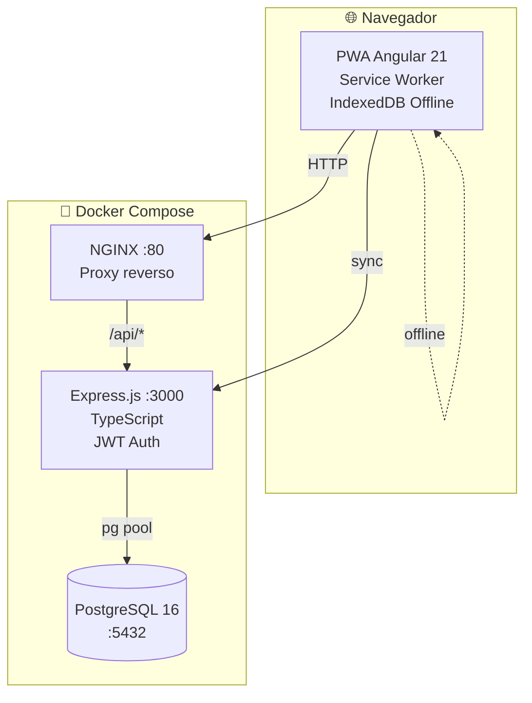

<p align="center">
  
</p>

<h1 align="center">📘 Cacique Tamanaco</h1>
<h3 align="center">Plataforma Educativa Móvil · Offline-First · PWA</h3>

<p align="center">
  
  
  
  
  
  
  
</p>

---

## 🧭 Índice

- [✨ Características](#-características)
- [🏗️ Arquitectura](#️-arquitectura)
- [📋 Requisitos](#-requisitos)
- [🚀 Instalación](#-instalación)
  - [Opción A: Docker (recomendado)](#opción-a-docker-recomendado)
  - [Opción B: Desarrollo manual](#opción-b-desarrollo-manual)
- [🔐 Acceso inicial](#-acceso-inicial)
- [📂 Estructura del proyecto](#-estructura-del-proyecto)
- [🛠️ Comandos útiles](#️-comandos-útiles)
- [📱 Funcionalidades](#-funcionalidades)
- [📄 Licencia](#-licencia)

---

## ✨ Características

| Categoría | Funcionalidades |
|-----------|----------------|
| 👥 **Usuarios** | CRUD completo, roles (Admin/Docente/Estudiante), JWT auth, bcrypt |
| 📖 **Cursos** | Creación, matriculación, estructura modular con clases |
| ✏️ **Editor Visual** | Canvas drag & drop, módulos, lecciones, tareas, quizzes, materiales |
| 🎯 **Quizzes** | Opción múltiple, verdadero/falso, tiempo límite, calificación automática |
| 📝 **Entregas** | Subida de archivos (PDF/Word), enlaces URL, calificación docente |
| ✅ **Asistencia** | Registro presente/ausente/justificado, soporte offline |
| 📊 **Reportes** | Rendimiento por curso, asistencia general, gráficos Chart.js, exportación CSV |
| 🔒 **Documentos** | Cifrado AES-256-CBC para documentos personales sensibles |
| 📴 **Offline-First** | IndexedDB (Dexie.js), sincronización masiva al reconectar |
| 🌓 **Tema** | Claro/Oscuro persistente |
| 📱 **Responsive** | Sidebar colapsable, off-canvas móvil, inspector overlay, hamburger menu |
| 🐳 **Docker** | Multi-stage builds, healthchecks, init scripts automáticos |

---

## 🏗️ Arquitectura



---

## 📋 Requisitos

- **Docker Engine** ≥ 24.x + **Docker Compose** V2
- **Git** (para clonar)
- 2 GB RAM libre
- Puertos **80** (frontend) y **3000** (API) disponibles
- Opcional: **Node.js 20+** y **npm 10+** (solo desarrollo)

---

## 🚀 Instalación

### Opción A: Docker (recomendado)

```bash
# 1. Clonar rama producción
git clone -b produccion https://github.com/Hector-dev/Plataforma_Educativa_Cacique_Tamanaco.git
cd Plataforma_Educativa_Cacique_Tamanaco

# 2. Copiar y configurar variables de entorno
cp .env.example .env
# Editar .env con tus propias contraseñas (IMPORTANTE)
nano .env

# 3. Construir y levantar
docker compose up --build -d

# 4. Verificar
docker compose ps
curl http://localhost:3000/api/health
```

**¡Listo!** Abre http://localhost en tu navegador.

### Opción B: Desarrollo manual

```bash
# Requiere Node.js 20+ y PostgreSQL 16 instalados

# 1. Clonar
git clone -b produccion https://github.com/Hector-dev/Plataforma_Educativa_Cacique_Tamanaco.git
cd Plataforma_Educativa_Cacique_Tamanaco

# 2. Backend
cd backend
cp .env.example .env     # Configurar conexión a PostgreSQL
npm ci
npm run build
npm start                # API en :3000

# 3. Frontend (otra terminal)
cd frontend
npm ci
npx ng serve             # Dev server en :4200
```

---

## 🔐 Acceso inicial

| Campo | Valor |
|-------|-------|
| Email | `admin@admin.com` |
| Contraseña | `admin` |
| Rol | Administrador |

> ⚠️ **Cambia la contraseña inmediatamente** desde el panel de usuarios.

---

## 📂 Estructura del proyecto

```
.
├── docker-compose.yml          # Orquestación de servicios
├── .env.example                # Plantilla de variables de entorno
├── .gitignore
│
├── backend/                    # API REST (Express + TypeScript)
│   ├── Dockerfile
│   ├── src/
│   │   ├── app.ts              # Entry point + middlewares + rutas
│   │   ├── db.ts               # Pool PostgreSQL
│   │   ├── controllers/        # Lógica de negocio (11 controladores)
│   │   ├── middleware/         # Auth (JWT) + Upload (multer)
│   │   ├── routes/             # Definición de endpoints
│   │   └── utils/              # Crypto (AES-256)
│   └── __tests__/              # Tests unitarios
│
├── frontend/                   # PWA (Angular 21 standalone)
│   ├── Dockerfile
│   ├── nginx.conf              # Proxy reverso → backend
│   ├── src/app/
│   │   ├── core/               # Servicios, interceptors, modelos
│   │   └── features/           # Course editor, Quiz player
│   └── public/icons/           # PWA icons
│
├── init-scripts/               # SQL auto-ejecutables (DDL + DML + migrations)
│   ├── 01_ddl.sql              # Esquema de tablas
│   ├── 02_dml.sql              # Usuario admin seed
│   ├── 03_migration_canvas.sql # Migración editor canvas
│   ├── 04_quiz.sql             # Sistema de quizzes
│   └── 05_migracion_fecha_asistencia.sql
│
├── e2e-tests/                  # Tests end-to-end (Playwright)
├── offline-package/            # Paquete para despliegue sin internet
│   ├── run-offline.sh          # Script de instalación offline
│   ├── docker-images/          # Imágenes .tar pre-construidas
│   └── README-OFFLINE.md
│
└── uploads/entregas/           # Archivos subidos (persistente)
```

---

## 🛠️ Comandos útiles

```bash
# Ver estado de servicios
docker compose ps

# Ver logs en tiempo real
docker compose logs -f backend
docker compose logs -f frontend

# Reiniciar un servicio
docker compose restart backend

# Detener todo
docker compose down

# Detener y borrar datos (⚠️ BD se pierde)
docker compose down -v

# Reconstruir después de cambios
docker compose up --build -d

# Backup de BD
docker exec cacique-postgres pg_dump -U cacique_admin cacique_tamanaco_db > backup.sql

# Restaurar BD
docker exec -i cacique-postgres psql -U cacique_admin cacique_tamanaco_db < backup.sql
```

---

## 📱 Funcionalidades

### 📊 Dashboard
Panel KPI con métricas en tiempo real, gráficos interactivos (Chart.js), acceso rápido a todas las secciones.

### 👥 Gestión de Usuarios
CRUD completo con roles: **Administrador**, **Docente**, **Estudiante**. Filtros por rol, búsqueda, modal de creación/edición.

### 📖 Cursos y Clases
Cursos con estructura modular expansible. Cada curso contiene clases con evaluaciones, materiales y recursos. Matriculación de estudiantes.

### ✏️ Editor Visual Canvas
Editor drag-and-drop para estructurar cursos visualmente. Módulos → Lecciones → Tareas/Quizzes/Materiales. Inspector lateral de propiedades. Soporte para undo/redo.

### 🎯 Sistema de Quizzes
Creación de quizzes con preguntas de opción múltiple o verdadero/falso. Tiempo límite configurable. Calificación automática. Tracking de intentos por estudiante.

### 📝 Entregas y Calificaciones
Subida de tareas en PDF/Word o mediante enlace URL. Calificación con notas preliminares y definitivas. Escala 0-20 puntos.

### ✅ Control de Asistencia
Registro diario con estados: presente, ausente, justificado. Funciona sin conexión — sincroniza al reconectar.

### 📊 Reportes
- **Asistencia general**: porcentajes por curso y estudiante
- **Rendimiento por curso**: promedios, entregas completadas
- **Asistencia por género**: distribución demográfica
- **Exportación CSV** descargable

---

## 📄 Licencia

MIT © 2026 — Desarrollado para la **U.E.N. Cacique Tamanaco**

---

<p align="center">
  <sub>Built with ❤️ using Angular · Express · PostgreSQL · Docker</sub>
</p>
