# Trabajo Especial de Grado

## Plataforma Educativa Móvil Cacique Tamanaco
### Sistema de Gestión de Aprendizaje (LMS) · Offline-First · PWA

---

### Datos del proyecto

| Campo | Detalle |
|-------|---------|
| **Institución** | U.E.N. Cacique Tamanaco |
| **Plataforma** | Web móvil (PWA) |
| **Área** | Educación — Gestión de aprendizaje (LMS/SGA) |
| **Versión** | v1.0 |
| **Licencia** | MIT |

---

## Resumen

El presente trabajo desarrolla una plataforma educativa móvil de tipo PWA que integra la gestión de cursos, estudiantes, docentes, evaluaciones, quizzes, entregas y control de asistencia, diseñada con enfoque **offline-first** para garantizar operatividad en entornos con conectividad limitada. El sistema se compone de una API REST construida con Express.js y TypeScript, una base de datos PostgreSQL y un frontend Angular 21 empaquetado como aplicación web instalable, con soporte de sincronización de datos mediante IndexedDB (Dexie.js).

---

## Índice

- [1. Introducción](#1-introducción)
- [2. Objetivos](#2-objetivos)
- [3. Marco Metodológico y Tecnológico](#3-marco-metodológico-y-tecnológico)
- [4. Arquitectura del Sistema](#4-arquitectura-del-sistema)
- [5. Modelo de Datos (DER)](#5-modelo-de-datos-der)
- [6. Componentes del Frontend](#6-componentes-del-frontend)
- [7. Funcionalidades](#7-funcionalidades)
- [8. Instalación y Despliegue](#8-instalación-y-despliegue)
- [9. Estructura del Proyecto](#9-estructura-del-proyecto)
- [10. Conclusiones](#10-conclusiones)
- [11. Referencias](#11-referencias)

---

## 1. Introducción

Las instituciones educativas requieren herramientas digitales que permitan centralizar el proceso de enseñanza-aprendizaje: publicación de contenidos, gestión de cursos, seguimiento de estudiantes y evaluación. La **U.E.N. Cacique Tamanaco** enfrenta, además, limitaciones de conectividad que dificultan el uso de plataformas exclusivamente en línea.

Esta plataforma aborda dicha problemática mediante una arquitectura **offline-first**: el estudiante consulta materiales, rinde evaluaciones y registra asistencia incluso sin conexión, y los datos se sincronizan automáticamente al restablecerse la red. El sistema incorpora control de roles (Administrador, Docente y Estudiante), editor visual de cursos, sistema de quizzes con calificación automática, entregas con rúbrica 0–20 y reportes exportables a CSV.

---

## 2. Objetivos

### 2.1 Objetivo General

Desarrollar una plataforma educativa móvil (PWA) que gestione el proceso de enseñanza-aprendizaje de la U.E.N. Cacique Tamanaco, garantizando su operatividad en escenarios sin conexión a internet.

### 2.2 Objetivos Específicos

- Diseñar un modelo de datos relacional que integre usuarios, cursos, matrículas, evaluaciones, quizzes y asistencia.
- Implementar una API REST segura (JWT + cifrado AES-256) para la gestión de los recursos académicos.
- Construir un frontend responsive con editor visual de cursos y soporte offline mediante IndexedDB.
- Desplegar la aplicación mediante contenedores Docker con inicialización automática de la base de datos.

---

## 3. Marco Metodológico y Tecnológico

| Tecnología | Versión | Rol |
|------------|---------|-----|
| Angular | 21 | Frontend (SPA, standalone components) |
| Express.js | 4.x | API REST (TypeScript) |
| PostgreSQL | 16 | Base de datos relacional |
| Docker | 27 | Orquestación de servicios |
| PWA | — | Instalable, offline-first |
| Chart.js | — | Visualización de reportes |
| Playwright | — | Pruebas end-to-end |

**Cifrado y autenticación:** JWT para sesiones, bcrypt para contraseñas y AES-256-CBC para documentos personales sensibles.

---

## 4. Arquitectura del Sistema

La aplicación se distribuye en dos contenedores: el frontend servido por NGINX (PWA) y el backend Express. El navegador almacena datos offline en IndexedDB y sincroniza con la API al recuperar conectividad.

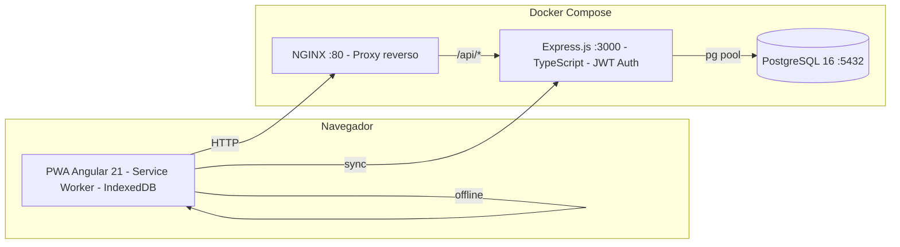


---

## 5. Modelo de Datos (DER)

El esquema relacional se presenta en tres niveles: un **mapa conceptual** de módulos funcionales, el **DER completo** por subsistemas y **diagramas de tablas con atributos** por módulo.

### 5.1 Mapa conceptual de módulos (macro)

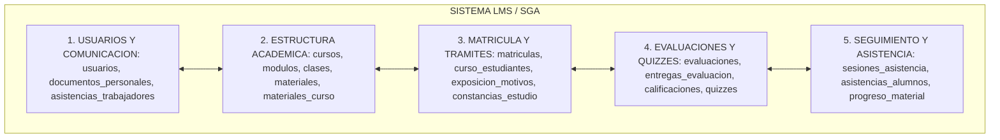


### 5.2 Diagrama ER completo por subsistemas (detalle)

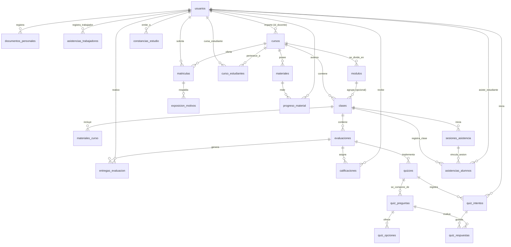


### 5.3 Diagramas de tablas por módulo (entidades y atributos)

Cada módulo se presenta en una diapositiva independiente para evitar el diagrama monolítico ilegible.

**Módulo 1: Usuarios y Comunicación**

> Usuarios, documentos personales y asistencia de trabajadores.

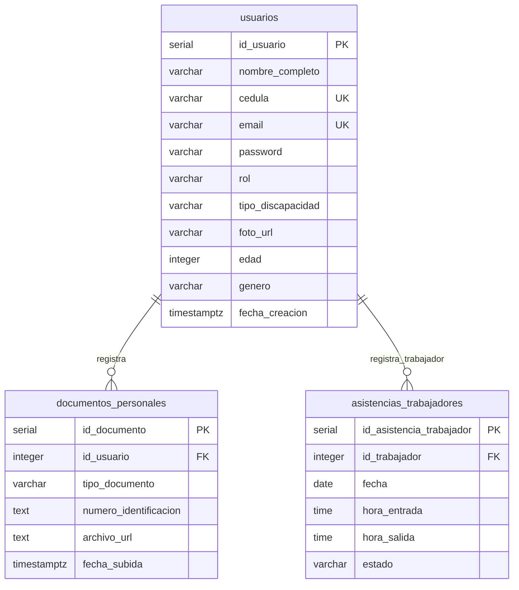


**Módulo 2: Estructura Académica y Contenidos**

> Cursos, módulos, clases, materiales y materiales por clase.

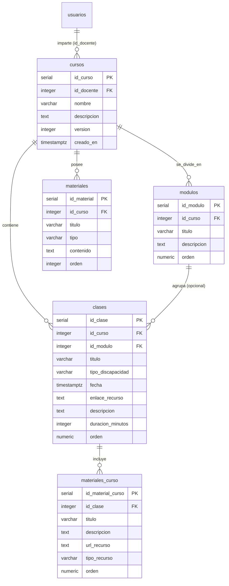


**Módulo 3: Matrícula y Trámites**

> Matrículas, curso-estudiantes, exposición de motivos y constancias.

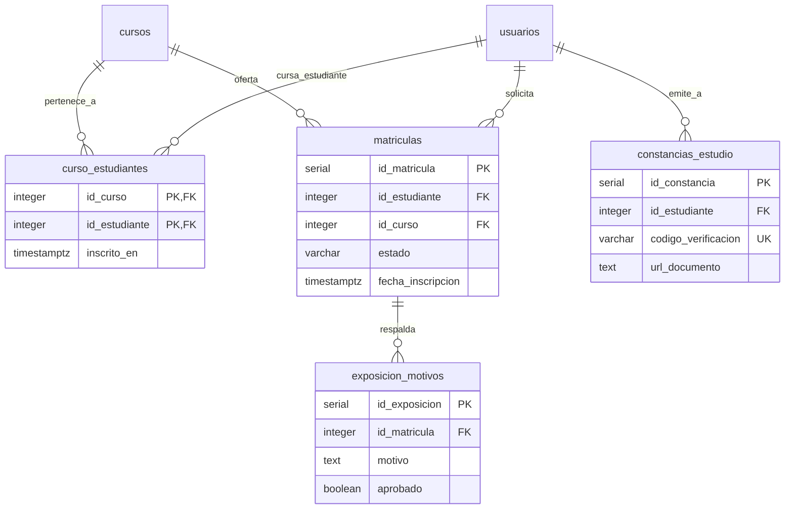


**Módulo 4: Evaluaciones, Entregas y Quizzes**

> Evaluaciones, entregas, calificaciones y el subsistema de quizzes.

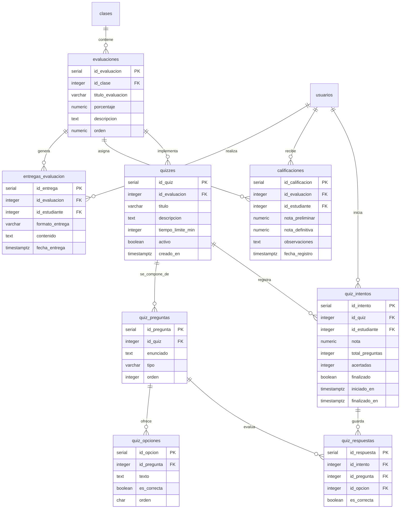


**Módulo 5: Seguimiento y Asistencia**

> Sesiones de asistencia, asistencias por alumno y progreso de material.

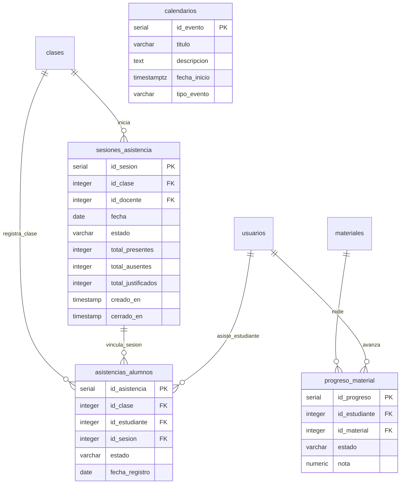


### 5.4 Subsistemas de detalle (diapositivas de apoyo)

**A. Subsistema de Evaluaciones y Quizzes**

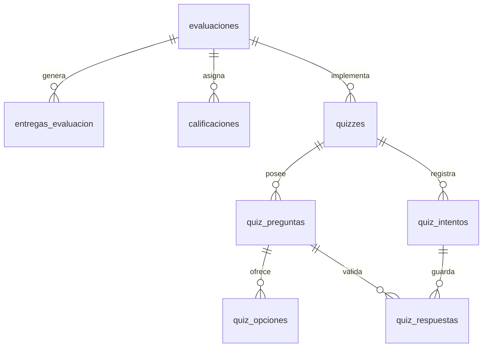


**B. Subsistema de Control de Asistencia y Progreso**

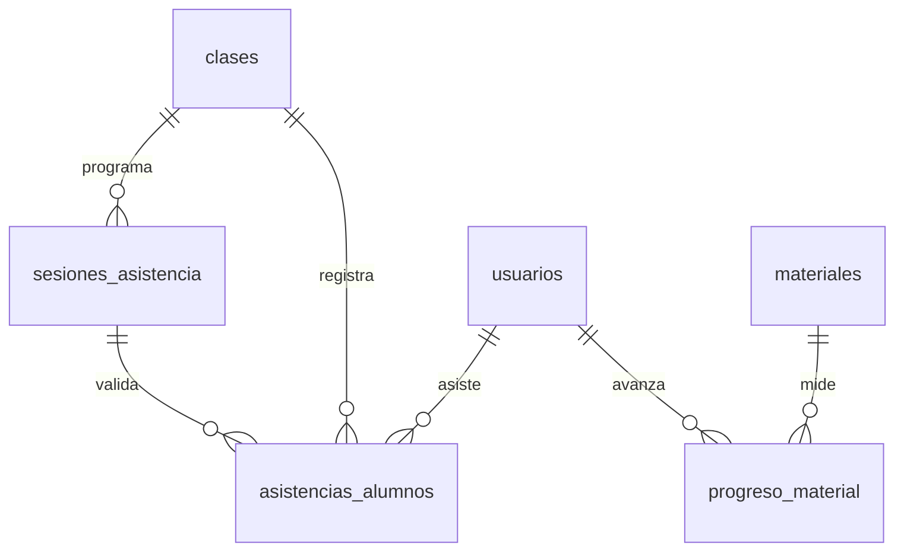


> **Puntos clave:** la relación opcional entre `modulos` y `clases` permite flexibilidad estructural; la separación entre `evaluaciones` convencionales y `quizzes` garantiza trazabilidad granular de respuestas por intento.

---

## 6. Componentes del Frontend

La aplicación sigue el patrón **container/presentational** con componentes standalone de Angular 21. A continuación se documentan el árbol de dependencias (vista general) y las responsabilidades de cada componente.

### 6.1 Vista general (dependencias)

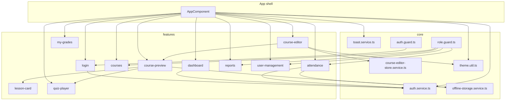


### auth.service.ts

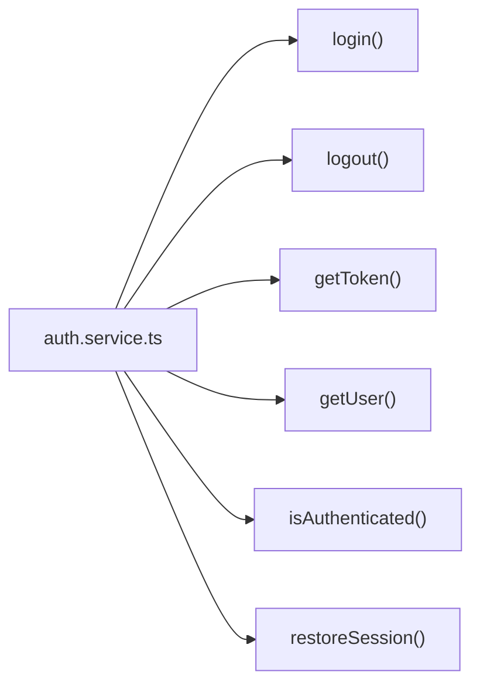


### toast.service.ts

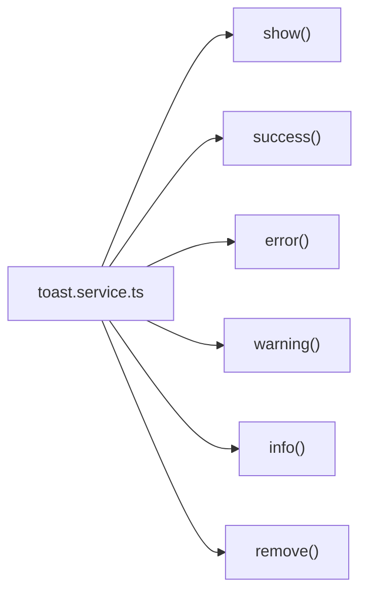


### offline-storage.service.ts

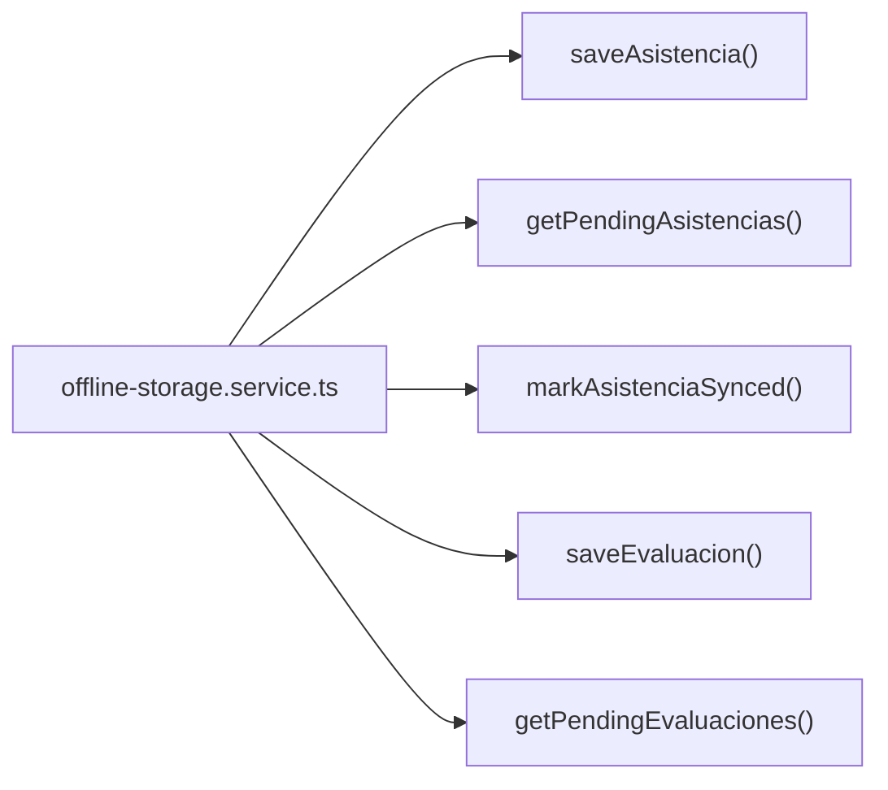


### course-editor-store.service.ts

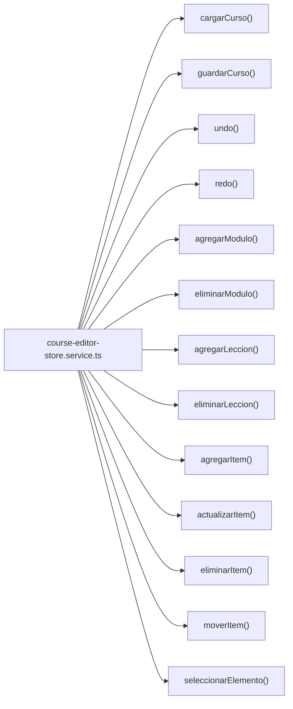


### auth.guard.ts

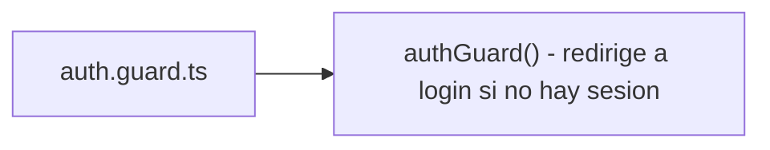


### role.guard.ts

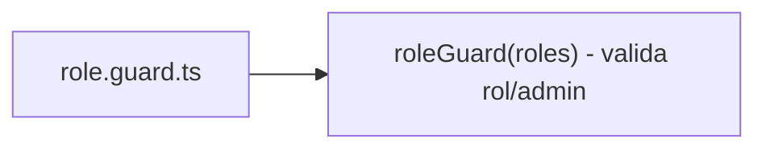


### theme.util.ts

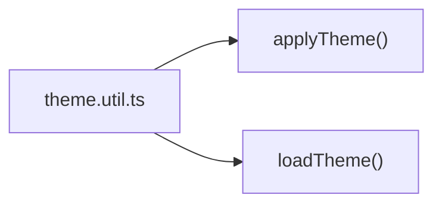


### AppComponent (app shell)

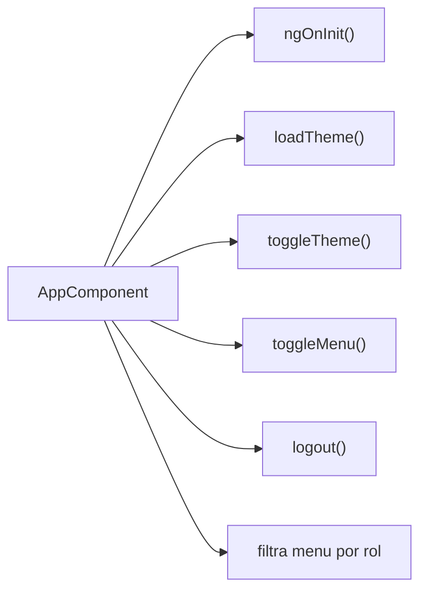


### login.component.ts

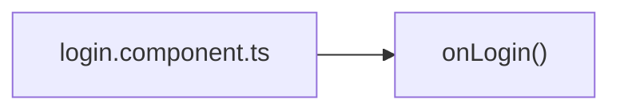


### dashboard.component.ts

```mermaid
flowchart LR
    D["dashboard.component.ts"] --> m1["ngOnInit()"]
    D --> m2["loadDashboard()"]
```


### courses.component.ts

```mermaid
flowchart LR
    C["courses.component.ts"] --> m1["loadCursos()"]
    C --> m2["crearCurso()"]
    C --> m3["abrirModal()"]
    C --> m4["cerrarModal()"]
    C --> m5["inscribirEstudiante()"]
    C --> m6["cargarEstudiantesDisponibles()"]
```


### course-editor.component.ts

```mermaid
flowchart LR
    E["course-editor.component.ts"] --> m1["guardar()"]
    E --> m2["deshacer()"]
    E --> m3["rehacer()"]
    E --> m4["dropEnCanvas()"]
    E --> m5["dropEnModulo()"]
    E --> m6["dropEnLeccion()"]
    E --> m7["agregarModulo()"]
    E --> m8["agregarLeccion()"]
    E --> m9["agregarItem()"]
    E --> m10["eliminarItem()"]
    E --> m11["seleccionarModulo()"]
    E --> m12["iniciarEdicion()"]
    E --> m13["toggleTheme()"]
    E --> m14["atajos teclado"]
```


### course-preview.component.ts

```mermaid
flowchart LR
    P["course-preview.component.ts"] --> m1["toggleLeccion()"]
    P --> m2["iconoItem()"]
    P --> m3["abrirNotas()"]
    P --> m4["guardarCalificacion()"]
    P --> m5["abrirEntrega()"]
    P --> m6["enviarEntrega()"]
    P --> m7["onArchivoSeleccionado()"]
```


### lesson-card.component.ts

```mermaid
flowchart LR
    LC["lesson-card.component.ts"] --> m1["iconoItem()"]
    LC --> m2["labelTipo()"]
    LC --> m3["vencida()"]
    LC --> m4["extraerEvaId()"]
    LC --> m5["sanitizeUrl()"]
    LC --> m6["videoError()"]
```


### quiz-player.component.ts

```mermaid
flowchart LR
    Q["quiz-player.component.ts"] --> m1["iniciarTimer()"]
    Q --> m2["formatoTiempo()"]
    Q --> m3["seleccionarRespuesta()"]
    Q --> m4["finalizarQuiz()"]
    Q --> m5["volver()"]
```


### attendance.component.ts

```mermaid
flowchart LR
    AT["attendance.component.ts"] --> m1["loadClases()"]
    AT --> m2["loadSesionHoy()"]
    AT --> m3["abrirAsistencia()"]
    AT --> m4["loadAlumnos()"]
    AT --> m5["marcar()"]
    AT --> m6["cerrarAsistencia()"]
    AT --> m7["syncNow()"]
    AT --> m8["puedeMarcar()"]
```


### reports.component.ts

```mermaid
flowchart LR
    RP["reports.component.ts"] --> m1["onTipoChange()"]
    RP --> m2["loadReporte()"]
    RP --> m3["descargarCSV()"]
```


### user-management.component.ts

```mermaid
flowchart LR
    UM["user-management.component.ts"] --> m1["loadUsuarios()"]
    UM --> m2["search()"]
    UM --> m3["goPage()"]
    UM --> m4["openCreateModal()"]
    UM --> m5["openEditModal()"]
    UM --> m6["saveUser()"]
    UM --> m7["deleteUser()"]
```


### my-grades.component.ts

```mermaid
flowchart LR
    MG["my-grades.component.ts"] --> m1["cargarMisNotas()"]
    MG --> m2["agruparNotasPorCurso()"]
    MG --> m3["toggleNotasCurso()"]
    MG --> m4["notaFinal()"]
```


---

## 7. Funcionalidades

| Categoría | Funcionalidades |
|-----------|----------------|
| **Usuarios** | CRUD completo, roles (Admin/Docente/Estudiante), JWT auth, bcrypt |
| **Cursos** | Creación, matriculación, estructura modular con clases |
| **Editor Visual** | Canvas drag & drop, módulos, lecciones, evaluaciones, quizzes, materiales |
| **Quizzes** | Opción múltiple, verdadero/falso, tiempo límite, calificación automática |
| **Entregas** | Subida de archivos (PDF/Word), enlaces URL, calificación docente |
| **Asistencia** | Registro presente/ausente/justificado, soporte offline |
| **Reportes** | Rendimiento por curso, asistencia general, gráficos Chart.js, exportación CSV |
| **Documentos** | Cifrado AES-256-CBC para documentos personales sensibles |
| **Offline-First** | IndexedDB (Dexie.js), sincronización masiva al reconectar |
| **Tema** | Claro/Oscuro persistente, toggle unificado (`theme.util.ts`) |
| **Responsive** | Sidebar colapsable, off-canvas móvil, inspector overlay, hamburger menu |
| **Docker** | Multi-stage builds, healthchecks, init scripts automáticos |

### 7.1 Dashboard
Panel KPI con métricas en tiempo real, gráficos interactivos (Chart.js) y acceso rápido a todas las secciones.

### 7.2 Setup Wizard (Primer Arranque)
Si no hay semillas precargadas, la app detecta la ausencia de administrador y redirige al **Setup Wizard**: configuración del servidor, creación del admin y confirmación — sin terminal ni `.env`.

### 7.3 Gestión de Usuarios
CRUD completo con roles (Administrador, Docente, Estudiante), filtros por rol, búsqueda y modal de creación/edición.

### 7.4 Cursos y Clases
Cursos con estructura modular expansible. Cada curso contiene clases con evaluaciones, materiales y recursos. Matriculación de estudiantes.

### 7.5 Editor Visual Canvas
Editor drag-and-drop para estructurar cursos visualmente: Módulos → Lecciones → Evaluaciones/Quizzes/Materiales. Inspector lateral de propiedades y soporte para undo/redo.

### 7.6 Sistema de Quizzes
Creación de quizzes con preguntas de opción múltiple o verdadero/falso, tiempo límite configurable, calificación automática y tracking de intentos por estudiante.

### 7.7 Entregas y Calificaciones
Subida de entregas en PDF/Word o mediante enlace URL. Calificación con notas preliminares y definitivas. Escala 0–20 puntos.

### 7.8 Control de Asistencia
Registro diario con estados (presente, ausente, justificado). Funciona sin conexión y sincroniza al reconectar.

### 7.9 Reportes
- Asistencia general: porcentajes por curso y estudiante
- Rendimiento por curso: promedios y entregas completadas
- Asistencia por género: distribución demográfica
- Exportación CSV descargable

---

## 8. Instalación y Despliegue

### 8.1 Requisitos

- Docker Engine ≥ 24.x + Docker Compose V2
- Git
- 2 GB RAM libre
- Puertos **80** (frontend) y **3000** (API) disponibles
- Opcional: Node.js 20+ y npm 10+ (solo desarrollo)

### 8.2 Opción A: Docker (recomendado)

```bash
# 1. Clonar rama v1.0
git clone -b v1.0 https://github.com/Hector-dev/Plataforma_Educativa_Cacique_Tamanaco.git
cd Plataforma_Educativa_Cacique_Tamanaco

# 2. Construir y levantar (SIN .env — secrets se auto-generan)
docker compose up --build -d

# 3. Verificar
docker compose ps
curl http://localhost/api/health
```


**¡Listo!** Abre http://localhost en tu navegador.

> No necesitas crear `.env`. Si existe, sus valores tienen prioridad. En caso contrario, Postgres usa `postgres:postgres` por defecto y los secrets (JWT, cifrado AES) se auto-generan con `crypto.randomBytes(32)` en el primer arranque, persistiéndose en el volumen dedicado `cacique_secrets`.

### 8.3 Opción B: Sin Docker (desarrollo manual)

```bash
# Requiere Node.js 20+ y PostgreSQL 16 instalados

# 1. Clonar
git clone -b v1.0 https://github.com/Hector-dev/Plataforma_Educativa_Cacique_Tamanaco.git
cd Plataforma_Educativa_Cacique_Tamanaco

# 2. Crear .env con conexión a tu PostgreSQL local
cp .env.example .env
# Editar .env con tus datos locales
nano .env

# 3. Backend
cd backend
cp .env.example .env     # Configurar conexión a PostgreSQL
npm ci
npm run build
npm start                # API en :3000

# 4. Frontend (otra terminal)
cd frontend
npm ci
npx ng serve             # Dev server en :4200
```


### 8.4 Acceso inicial

| Campo | Valor |
|-------|-------|
| URL | http://localhost |
| Email (seed) | `admin@admin.com` |
| Contraseña (seed) | `admin` |
| Rol | Administrador |

> Si eliminas los scripts de init, la app muestra un **Setup Wizard** automático al entrar a http://localhost. Crea el admin desde la web, sin terminal ni `.env`. Cambia la contraseña seed desde el panel de usuarios.

### 8.5 Comandos útiles

```bash
# Ver estado de servicios
docker compose ps

# Ver logs en tiempo real
docker compose logs -f backend
docker compose logs -f frontend

# Reiniciar un servicio
docker compose restart backend

# Detener todo
docker compose down

# Detener y borrar datos (⚠️ BD se pierde)
docker compose down -v

# Reconstruir después de cambios
docker compose up --build -d

# Etiquetar y publicar imágenes en Docker Hub
docker tag cacique-backend:latest <usuario>/cacique-backend:latest
docker tag cacique-frontend:latest <usuario>/cacique-frontend:latest
docker push <usuario>/cacique-backend:latest
docker push <usuario>/cacique-frontend:latest

# Backup de BD (reemplazar USER por el de tu .env, o postgres si usas defaults)
docker exec cacique-postgres pg_dump -U postgres cacique_tamanaco_db > backup.sql

# Restaurar BD
docker exec -i cacique-postgres psql -U postgres cacique_tamanaco_db < backup.sql
```


---

## 9. Estructura del Proyecto

```
.
├── docker-compose.yml          # Orquestación de servicios + volumen cacique_secrets
├── .env.example                # Plantilla de variables de entorno (ahora opcional)
├── .gitignore
│
├── backend/                    # API REST (Express + TypeScript)
│   ├── Dockerfile
│   ├── src/
│   │   ├── app.ts              # Entry point + middlewares + rutas
│   │   ├── config.ts           # ⭐ Central de secrets (auto-generación JWT/AES)
│   │   ├── db.ts               # Pool PostgreSQL
│   │   ├── controllers/        # Lógica de negocio (12 controladores)
│   │   ├── middleware/         # Auth (JWT) + Upload (multer)
│   │   ├── routes/             # Definición de endpoints
│   │   └── utils/              # Crypto (AES-256)
│   └── __tests__/              # Tests unitarios
│
├── frontend/                   # PWA (Angular 21 standalone)
│   ├── Dockerfile
│   ├── nginx.conf              # Proxy reverso → backend
│   ├── src/app/
│   │   ├── core/               # Servicios, interceptores, modelos, utils
│   │   │   └── utils/          # theme.util.ts (tema oscuro/claro unificado)
│   │   └── features/           # Course editor, Quiz player, Setup Wizard ⭐
│   └── public/                 # favicon.ico, manifest.webmanifest, icons/
│
├── init-scripts/               # SQL auto-ejecutables (DDL + DML + migrations)
│   ├── 01_ddl.sql              # Esquema de tablas
│   ├── 02_dml.sql              # Usuario admin seed
│   ├── 03_migration_canvas.sql # Migración editor canvas
│   ├── 04_quiz.sql             # Sistema de quizzes
│   ├── 05_e2e_seed.sql         # Datos demo para pruebas E2E
│   ├── 05_migracion_fecha_asistencia.sql
│   ├── 06_sesiones_asistencia.sql # Migración asistencia por sesiones diarias
│   ├── 07_entregas_tarea.sql   # Tablas de entregas (migrada en 08)
│   └── 08_migrar_tareas_a_evaluaciones.sql # ⭐ Tareas → evaluaciones
│
├── e2e-tests/                  # Tests end-to-end (Playwright)
├── offline-package/            # Paquete para despliegue sin internet
│   ├── run-offline.sh          # Script de instalación offline
│   ├── docker-images/          # Imágenes .tar pre-construidas
│   └── README-OFFLINE.md
│
└── uploads/entregas/           # Archivos subidos (persistente)
```


---

## 10. Conclusiones

- La arquitectura **offline-first** permite que estudiantes y docentes continúen la actividad académica sin conexión, sincronizando al recuperar conectividad.
- La separación de responsabilidades entre **evaluaciones**, **entregas** y **quizzes** garantiza trazabilidad granular del desempeño estudiantil.
- El uso de contenedores Docker con scripts de inicialización automática simplifica el despliegue y la reproducibilidad del entorno.
- El control de roles y el cifrado de documentos sensibles responden a los requisitos de seguridad y privacidad del contexto educativo.

---

## 11. Referencias

- Mermaid: Diagramas como código — https://mermaid.js.org
- Angular: Documentación oficial — https://angular.dev
- Express.js: Documentación oficial — https://expressjs.com
- PostgreSQL: Documentación oficial — https://www.postgresql.org/docs
- Dexie.js: IndexedDB simplificado — https://dexie.org
- Chart.js: Gráficos interactivos — https://www.chartjs.org

---

## Licencia

MIT © 2026 — Desarrollado para la **U.E.N. Cacique Tamanaco**

---

<p align="center">
  <sub>Built with Angular · Express · PostgreSQL · Docker</sub>
</p>
