# Diagramas — Plataforma Educativa Cacique Tamanaco

Diagramas Mermaid generados a partir del esquema real de la base de datos
(`init-scripts/`) y de los componentes del frontend (`frontend/src/app/`).

---

## 1. Diagrama de la base de datos

> Esquema final: las tablas `tareas_curso` y `entregas_tarea` ya no existen
> (migración `08_migrar_tareas_a_evaluaciones.sql`).
>
> Para la **defensa de tesis** el DER se presenta en dos niveles de abstracción:
> un **mapa conceptual** de módulos funcionales (macro) y diagramas de **detalle**
> segmentados por subsistema. Las entidades están agrupadas jerárquicamente por
> módulo para que los generadores visuales (Mermaid Live Editor, Draw.io)
> desplieguen un diagrama limpio y ordenado.

### 1.1 Mapa conceptual de módulos (macro)

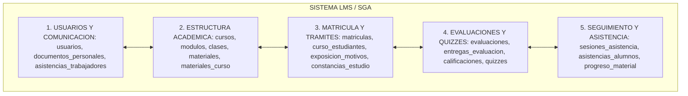
```mermaid
flowchart LR
    subgraph LMS["SISTEMA LMS / SGA"]
        direction LR
        M1["1. USUARIOS Y COMUNICACION: usuarios, documentos_personales, asistencias_trabajadores"]
        M2["2. ESTRUCTURA ACADEMICA: cursos, modulos, clases, materiales, materiales_curso"]
        M3["3. MATRICULA Y TRAMITES: matriculas, curso_estudiantes, exposicion_motivos, constancias_estudio"]
        M4["4. EVALUACIONES Y QUIZZES: evaluaciones, entregas_evaluacion, calificaciones, quizzes"]
        M5["5. SEGUIMIENTO Y ASISTENCIA: sesiones_asistencia, asistencias_alumnos, progreso_material"]
    end
    M1 <--> M2
    M2 <--> M3
    M3 <--> M4
    M4 <--> M5
```

### 1.2 Diagrama de tablas por módulo (entidades y atributos)

Cada módulo se presenta en una diapositiva independiente para evitar el
diagrama monolítico ilegible. Son las **28 tablas finales** (sin
`tareas_curso`/`entregas_tarea`).

**Módulo 1: Usuarios y Comunicación**

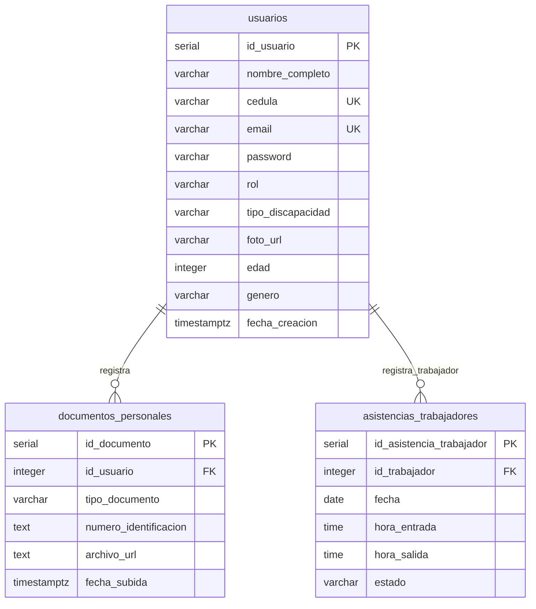
```mermaid
erDiagram
    usuarios ||--o{ documentos_personales : "registra"
    usuarios ||--o{ asistencias_trabajadores : "registra_trabajador"

    usuarios {
        serial id_usuario PK
        varchar nombre_completo
        varchar cedula UK
        varchar email UK
        varchar password
        varchar rol
        varchar tipo_discapacidad
        varchar foto_url
        integer edad
        varchar genero
        timestamptz fecha_creacion
    }
    documentos_personales {
        serial id_documento PK
        integer id_usuario FK
        varchar tipo_documento
        text numero_identificacion
        text archivo_url
        timestamptz fecha_subida
    }
    asistencias_trabajadores {
        serial id_asistencia_trabajador PK
        integer id_trabajador FK
        date fecha
        time hora_entrada
        time hora_salida
        varchar estado
    }
```

**Módulo 2: Estructura Académica y Contenidos**

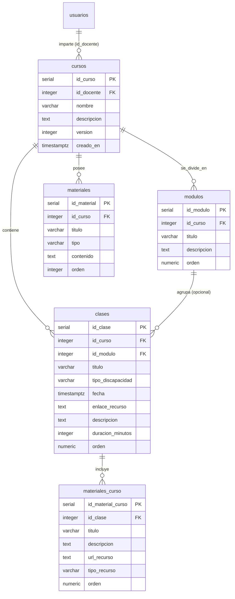
```mermaid
erDiagram
    usuarios ||--o{ cursos : "imparte (id_docente)"
    cursos ||--o{ modulos : "se_divide_en"
    cursos ||--o{ clases : "contiene"
    cursos ||--o{ materiales : "posee"
    modulos ||--o{ clases : "agrupa (opcional)"
    clases ||--o{ materiales_curso : "incluye"

    cursos {
        serial id_curso PK
        integer id_docente FK
        varchar nombre
        text descripcion
        integer version
        timestamptz creado_en
    }
    modulos {
        serial id_modulo PK
        integer id_curso FK
        varchar titulo
        text descripcion
        numeric orden
    }
    clases {
        serial id_clase PK
        integer id_curso FK
        integer id_modulo FK
        varchar titulo
        varchar tipo_discapacidad
        timestamptz fecha
        text enlace_recurso
        text descripcion
        integer duracion_minutos
        numeric orden
    }
    materiales {
        serial id_material PK
        integer id_curso FK
        varchar titulo
        varchar tipo
        text contenido
        integer orden
    }
    materiales_curso {
        serial id_material_curso PK
        integer id_clase FK
        varchar titulo
        text descripcion
        text url_recurso
        varchar tipo_recurso
        numeric orden
    }
```

**Módulo 3: Matrícula y Trámites**

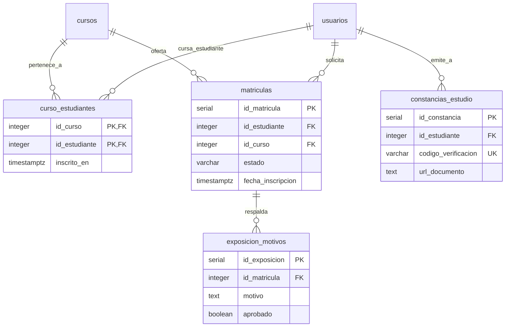
```mermaid
erDiagram
    usuarios ||--o{ curso_estudiantes : "cursa_estudiante"
    cursos ||--o{ curso_estudiantes : "pertenece_a"
    usuarios ||--o{ matriculas : "solicita"
    cursos ||--o{ matriculas : "oferta"
    matriculas ||--o{ exposicion_motivos : "respalda"
    usuarios ||--o{ constancias_estudio : "emite_a"

    matriculas {
        serial id_matricula PK
        integer id_estudiante FK
        integer id_curso FK
        varchar estado
        timestamptz fecha_inscripcion
    }
    curso_estudiantes {
        integer id_curso PK, FK
        integer id_estudiante PK, FK
        timestamptz inscrito_en
    }
    exposicion_motivos {
        serial id_exposicion PK
        integer id_matricula FK
        text motivo
        boolean aprobado
    }
    constancias_estudio {
        serial id_constancia PK
        integer id_estudiante FK
        varchar codigo_verificacion UK
        text url_documento
    }
```

**Módulo 4: Evaluaciones, Entregas y Quizzes**

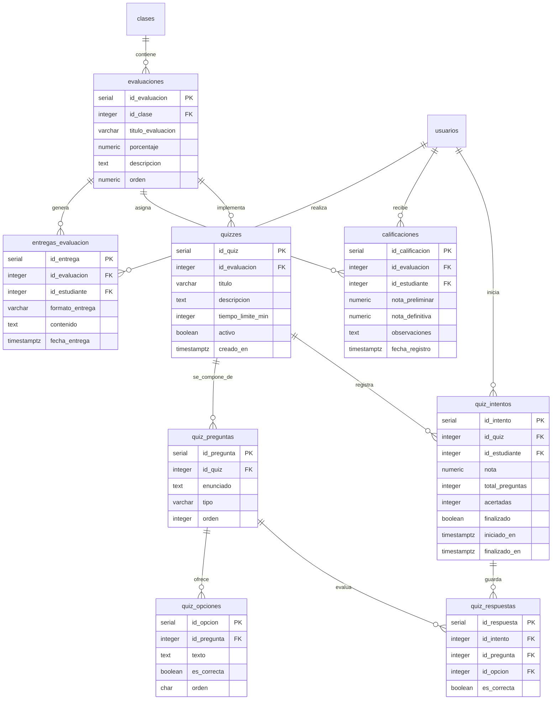
```mermaid
erDiagram
    clases ||--o{ evaluaciones : "contiene"
    evaluaciones ||--o{ entregas_evaluacion : "genera"
    evaluaciones ||--o{ calificaciones : "asigna"
    evaluaciones ||--o{ quizzes : "implementa"
    usuarios ||--o{ entregas_evaluacion : "realiza"
    usuarios ||--o{ calificaciones : "recibe"
    quizzes ||--o{ quiz_preguntas : "se_compone_de"
    quiz_preguntas ||--o{ quiz_opciones : "ofrece"
    quizzes ||--o{ quiz_intentos : "registra"
    usuarios ||--o{ quiz_intentos : "inicia"
    quiz_intentos ||--o{ quiz_respuestas : "guarda"
    quiz_preguntas ||--o{ quiz_respuestas : "evalua"

    evaluaciones {
        serial id_evaluacion PK
        integer id_clase FK
        varchar titulo_evaluacion
        numeric porcentaje
        text descripcion
        numeric orden
    }
    entregas_evaluacion {
        serial id_entrega PK
        integer id_evaluacion FK
        integer id_estudiante FK
        varchar formato_entrega
        text contenido
        timestamptz fecha_entrega
    }
    calificaciones {
        serial id_calificacion PK
        integer id_evaluacion FK
        integer id_estudiante FK
        numeric nota_preliminar
        numeric nota_definitiva
        text observaciones
        timestamptz fecha_registro
    }
    quizzes {
        serial id_quiz PK
        integer id_evaluacion FK
        varchar titulo
        text descripcion
        integer tiempo_limite_min
        boolean activo
        timestamptz creado_en
    }
    quiz_preguntas {
        serial id_pregunta PK
        integer id_quiz FK
        text enunciado
        varchar tipo
        integer orden
    }
    quiz_opciones {
        serial id_opcion PK
        integer id_pregunta FK
        text texto
        boolean es_correcta
        char orden
    }
    quiz_intentos {
        serial id_intento PK
        integer id_quiz FK
        integer id_estudiante FK
        numeric nota
        integer total_preguntas
        integer acertadas
        boolean finalizado
        timestamptz iniciado_en
        timestamptz finalizado_en
    }
    quiz_respuestas {
        serial id_respuesta PK
        integer id_intento FK
        integer id_pregunta FK
        integer id_opcion FK
        boolean es_correcta
    }
```

**Módulo 5: Seguimiento y Asistencia**

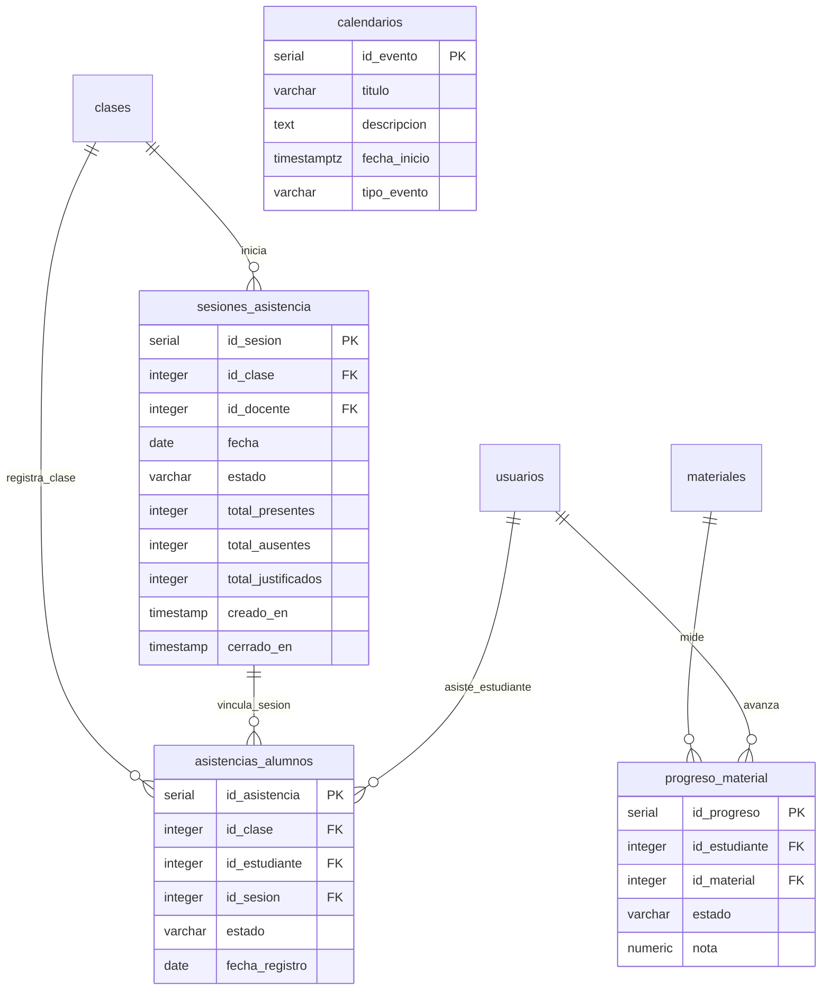
```mermaid
erDiagram
    clases ||--o{ sesiones_asistencia : "inicia"
    clases ||--o{ asistencias_alumnos : "registra_clase"
    sesiones_asistencia ||--o{ asistencias_alumnos : "vincula_sesion"
    usuarios ||--o{ asistencias_alumnos : "asiste_estudiante"
    materiales ||--o{ progreso_material : "mide"
    usuarios ||--o{ progreso_material : "avanza"

    sesiones_asistencia {
        serial id_sesion PK
        integer id_clase FK
        integer id_docente FK
        date fecha
        varchar estado
        integer total_presentes
        integer total_ausentes
        integer total_justificados
        timestamp creado_en
        timestamp cerrado_en
    }
    asistencias_alumnos {
        serial id_asistencia PK
        integer id_clase FK
        integer id_estudiante FK
        integer id_sesion FK
        varchar estado
        date fecha_registro
    }
    progreso_material {
        serial id_progreso PK
        integer id_estudiante FK
        integer id_material FK
        varchar estado
        numeric nota
    }
    calendarios {
        serial id_evento PK
        varchar titulo
        text descripcion
        timestamptz fecha_inicio
        varchar tipo_evento
    }
```

### 1.3 Sub-diagramas modulares para diapositivas

**A. Subsistema de Evaluaciones y Quizzes**

> **Objetivo:** explicar cómo el sistema gestiona tanto evaluaciones
> tradicionales como exámenes interactivos (quizzes).

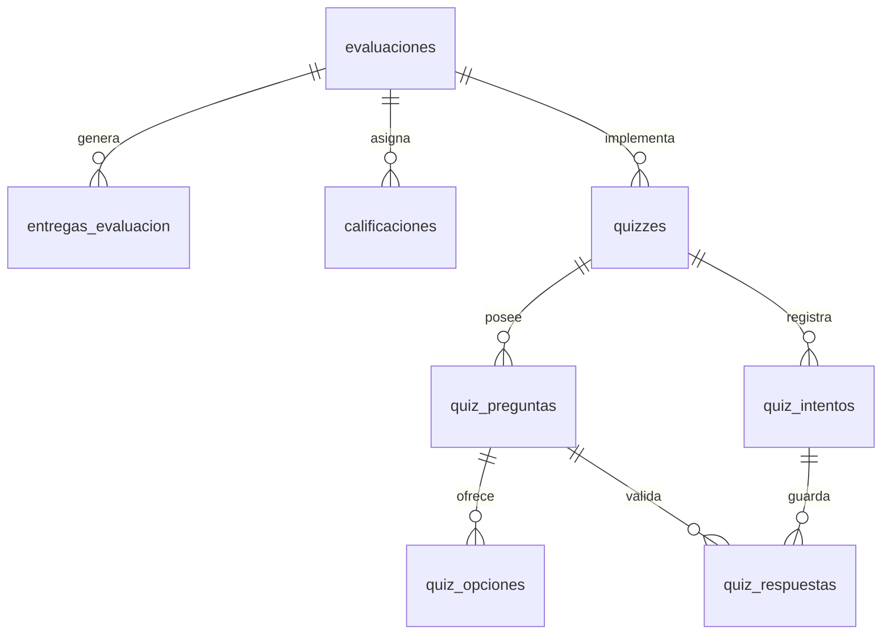
```mermaid
erDiagram
    evaluaciones ||--o{ entregas_evaluacion : "genera"
    evaluaciones ||--o{ calificaciones : "asigna"
    evaluaciones ||--o{ quizzes : "implementa"
    quizzes ||--o{ quiz_preguntas : "posee"
    quiz_preguntas ||--o{ quiz_opciones : "ofrece"
    quizzes ||--o{ quiz_intentos : "registra"
    quiz_intentos ||--o{ quiz_respuestas : "guarda"
    quiz_preguntas ||--o{ quiz_respuestas : "valida"
```

**B. Subsistema de Control de Asistencia y Progreso**

> **Objetivo:** demostrar la trazabilidad del estudiante respecto a la
> asistencia a clases y el consumo de contenidos.

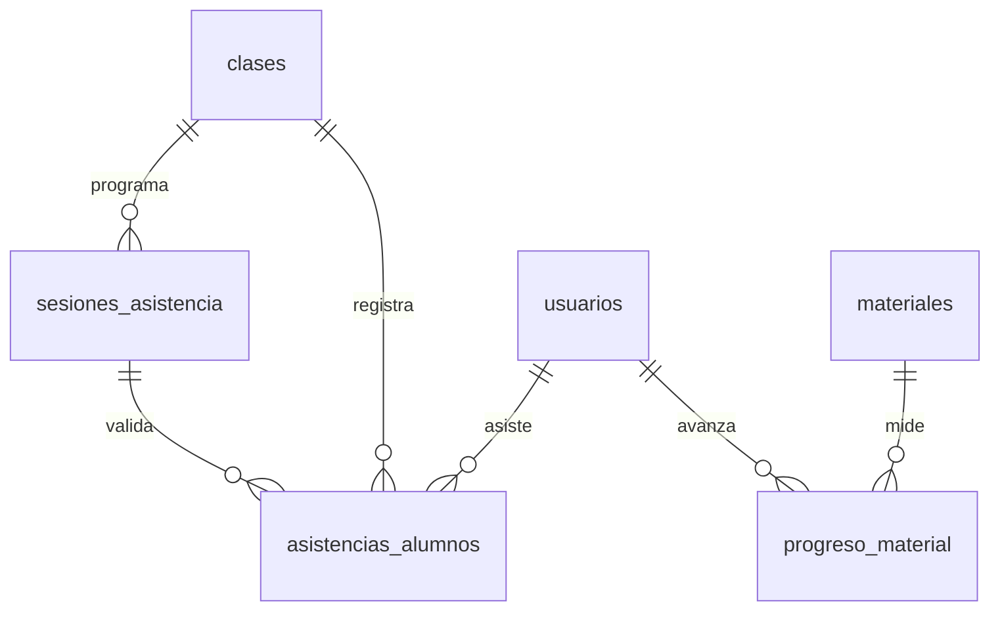
```mermaid
erDiagram
    usuarios ||--o{ asistencias_alumnos : "asiste"
    clases ||--o{ sesiones_asistencia : "programa"
    clases ||--o{ asistencias_alumnos : "registra"
    sesiones_asistencia ||--o{ asistencias_alumnos : "valida"

    materiales ||--o{ progreso_material : "mide"
    usuarios ||--o{ progreso_material : "avanza"
```

---

## 2. Diagrama de componentes

### 2.1 Vista general (solo nombres)

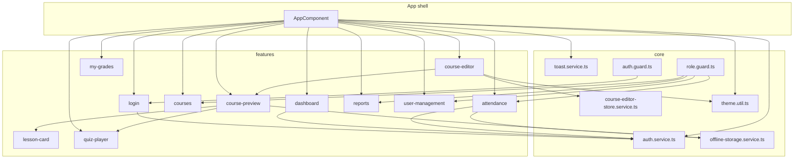
```mermaid
flowchart TD
    subgraph Core["core"]
        Auth["auth.service.ts"]
        Toast["toast.service.ts"]
        Offline["offline-storage.service.ts"]
        Store["course-editor-store.service.ts"]
        AuthGuard["auth.guard.ts"]
        RoleGuard["role.guard.ts"]
        Theme["theme.util.ts"]
    end

    subgraph Shell["App shell"]
        App["AppComponent"]
    end

    subgraph Features["features"]
        Login["login"]
        Dashboard["dashboard"]
        Courses["courses"]
        Editor["course-editor"]
        Preview["course-preview"]
        LessonCard["lesson-card"]
        Quiz["quiz-player"]
        Attendance["attendance"]
        Reports["reports"]
        Users["user-management"]
        Grades["my-grades"]
    end

    App --> Login
    App --> Dashboard
    App --> Courses
    App --> Editor
    App --> Preview
    App --> Quiz
    App --> Attendance
    App --> Reports
    App --> Users
    App --> Grades

    Login --> Auth
    Dashboard --> Auth
    App --> Auth
    App --> Toast
    App --> Theme
    Editor --> Theme

    Editor --> Store
    Editor --> Preview
    Preview --> LessonCard
    Preview --> Quiz

    Attendance --> Offline
    Preview --> Offline
    Attendance --> Auth

    AuthGuard --> Login
    RoleGuard --> Courses
    RoleGuard --> Users
    RoleGuard --> Attendance
    RoleGuard --> Reports
```

### 2.2 Funciones por componente

#### auth.service.ts

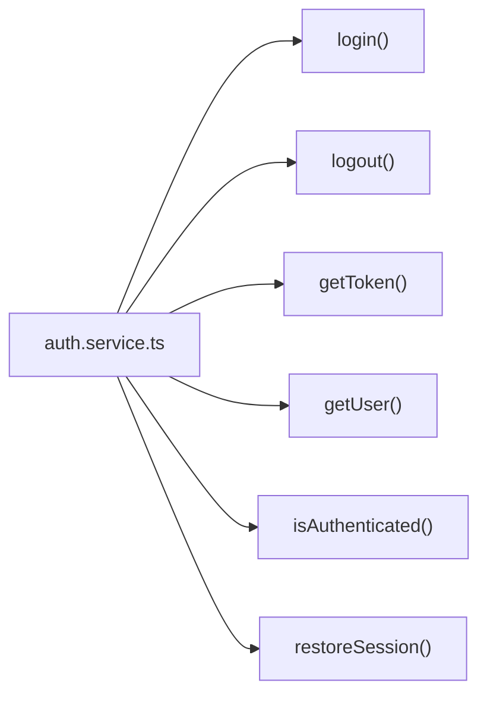
```mermaid
flowchart LR
    A["auth.service.ts"] --> m1["login()"]
    A --> m2["logout()"]
    A --> m3["getToken()"]
    A --> m4["getUser()"]
    A --> m5["isAuthenticated()"]
    A --> m6["restoreSession()"]
```

#### toast.service.ts

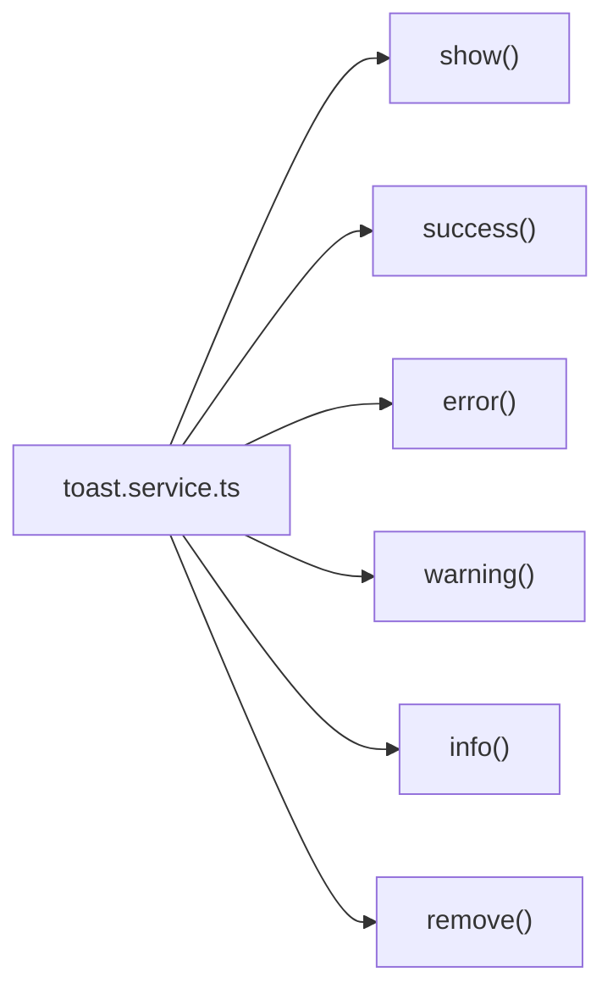
```mermaid
flowchart LR
    T["toast.service.ts"] --> m1["show()"]
    T --> m2["success()"]
    T --> m3["error()"]
    T --> m4["warning()"]
    T --> m5["info()"]
    T --> m6["remove()"]
```

#### offline-storage.service.ts

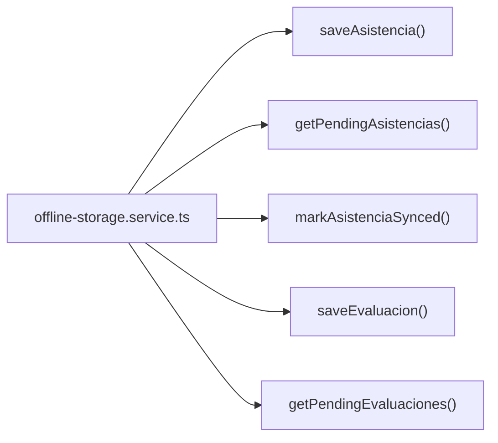
```mermaid
flowchart LR
    O["offline-storage.service.ts"] --> m1["saveAsistencia()"]
    O --> m2["getPendingAsistencias()"]
    O --> m3["markAsistenciaSynced()"]
    O --> m4["saveEvaluacion()"]
    O --> m5["getPendingEvaluaciones()"]
```

#### course-editor-store.service.ts

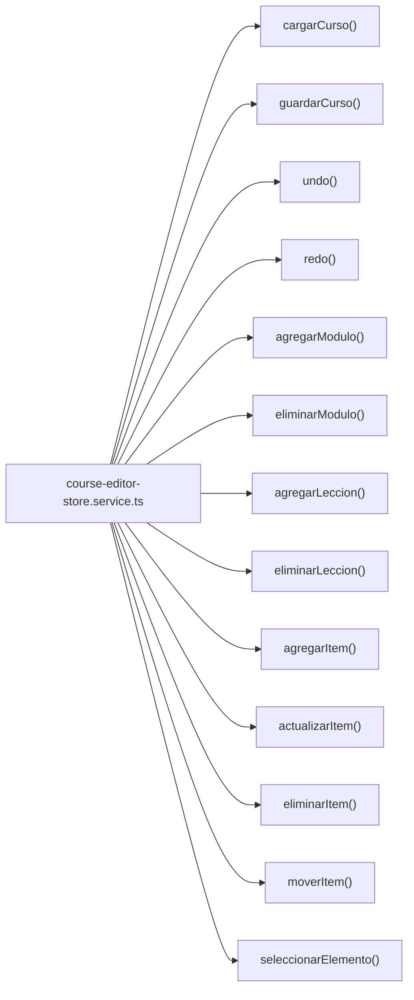
```mermaid
flowchart LR
    S["course-editor-store.service.ts"] --> m1["cargarCurso()"]
    S --> m2["guardarCurso()"]
    S --> m3["undo()"]
    S --> m4["redo()"]
    S --> m5["agregarModulo()"]
    S --> m6["eliminarModulo()"]
    S --> m7["agregarLeccion()"]
    S --> m8["eliminarLeccion()"]
    S --> m9["agregarItem()"]
    S --> m10["actualizarItem()"]
    S --> m11["eliminarItem()"]
    S --> m12["moverItem()"]
    S --> m13["seleccionarElemento()"]
```

#### auth.guard.ts

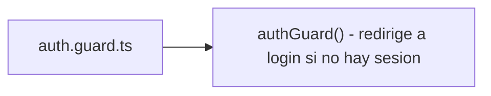
```mermaid
flowchart LR
    G["auth.guard.ts"] --> m1["authGuard() - redirige a login si no hay sesion"]
```

#### role.guard.ts

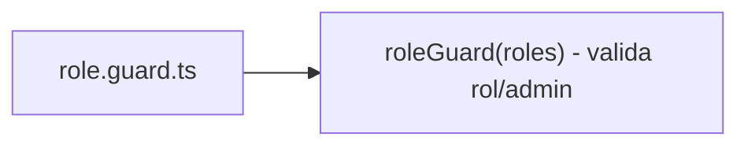
```mermaid
flowchart LR
    R["role.guard.ts"] --> m1["roleGuard(roles) - valida rol/admin"]
```

#### theme.util.ts

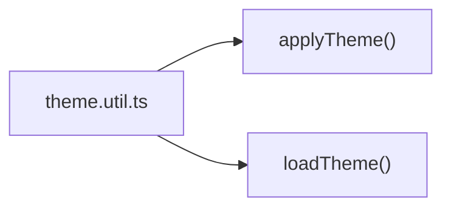
```mermaid
flowchart LR
    U["theme.util.ts"] --> m1["applyTheme()"]
    U --> m2["loadTheme()"]
```

#### AppComponent (app shell)

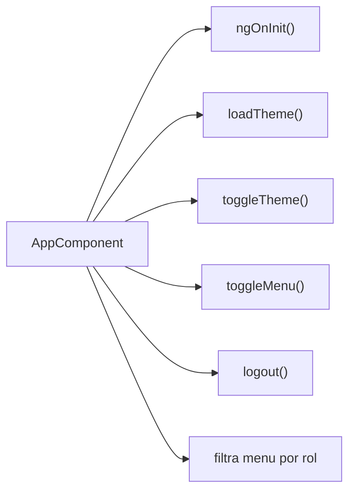
```mermaid
flowchart LR
    A["AppComponent"] --> m1["ngOnInit()"]
    A --> m2["loadTheme()"]
    A --> m3["toggleTheme()"]
    A --> m4["toggleMenu()"]
    A --> m5["logout()"]
    A --> m6["filtra menu por rol"]
```

#### login.component.ts

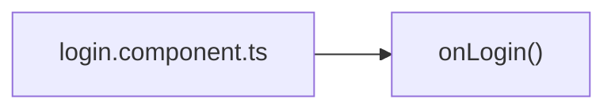
```mermaid
flowchart LR
    L["login.component.ts"] --> m1["onLogin()"]
```

#### dashboard.component.ts

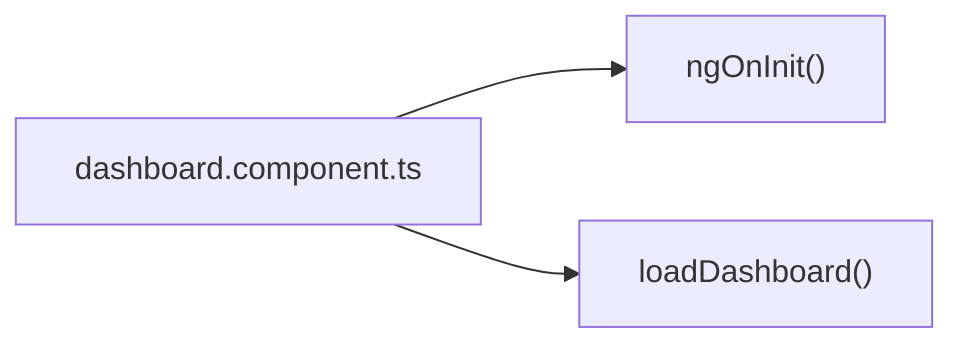
```mermaid
flowchart LR
    D["dashboard.component.ts"] --> m1["ngOnInit()"]
    D --> m2["loadDashboard()"]
```

#### courses.component.ts

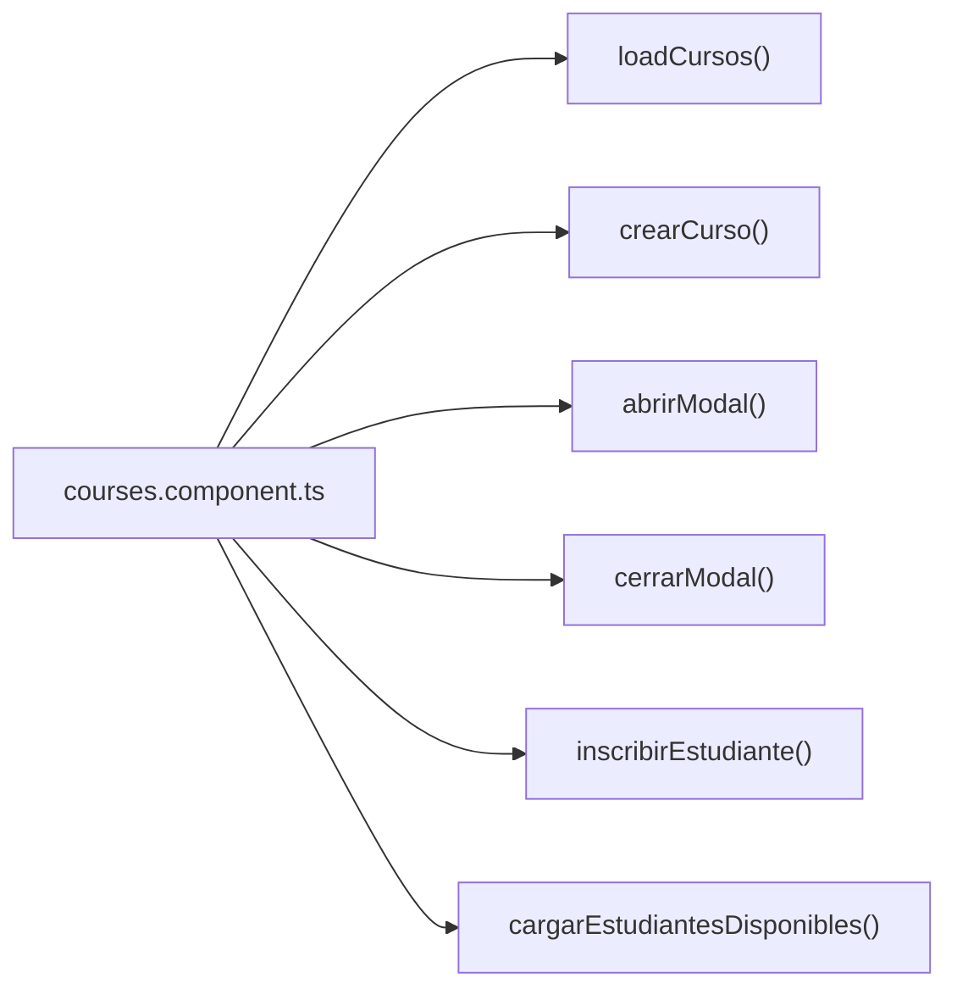
```mermaid
flowchart LR
    C["courses.component.ts"] --> m1["loadCursos()"]
    C --> m2["crearCurso()"]
    C --> m3["abrirModal()"]
    C --> m4["cerrarModal()"]
    C --> m5["inscribirEstudiante()"]
    C --> m6["cargarEstudiantesDisponibles()"]
```

#### course-editor.component.ts

```mermaid
flowchart LR
    E["course-editor.component.ts"] --> m1["guardar()"]
    E --> m2["deshacer()"]
    E --> m3["rehacer()"]
    E --> m4["dropEnCanvas()"]
    E --> m5["dropEnModulo()"]
    E --> m6["dropEnLeccion()"]
    E --> m7["agregarModulo()"]
    E --> m8["agregarLeccion()"]
    E --> m9["agregarItem()"]
    E --> m10["eliminarItem()"]
    E --> m11["seleccionarModulo()"]
    E --> m12["iniciarEdicion()"]
    E --> m13["toggleTheme()"]
    E --> m14["atajos teclado"]
```

#### course-preview.component.ts

```mermaid
flowchart LR
    P["course-preview.component.ts"] --> m1["toggleLeccion()"]
    P --> m2["iconoItem()"]
    P --> m3["abrirNotas()"]
    P --> m4["guardarCalificacion()"]
    P --> m5["abrirEntrega()"]
    P --> m6["enviarEntrega()"]
    P --> m7["onArchivoSeleccionado()"]
```

#### lesson-card.component.ts

```mermaid
flowchart LR
    LC["lesson-card.component.ts"] --> m1["iconoItem()"]
    LC --> m2["labelTipo()"]
    LC --> m3["vencida()"]
    LC --> m4["extraerEvaId()"]
    LC --> m5["sanitizeUrl()"]
    LC --> m6["videoError()"]
```

#### quiz-player.component.ts

```mermaid
flowchart LR
    Q["quiz-player.component.ts"] --> m1["iniciarTimer()"]
    Q --> m2["formatoTiempo()"]
    Q --> m3["seleccionarRespuesta()"]
    Q --> m4["finalizarQuiz()"]
    Q --> m5["volver()"]
```

#### attendance.component.ts

```mermaid
flowchart LR
    AT["attendance.component.ts"] --> m1["loadClases()"]
    AT --> m2["loadSesionHoy()"]
    AT --> m3["abrirAsistencia()"]
    AT --> m4["loadAlumnos()"]
    AT --> m5["marcar()"]
    AT --> m6["cerrarAsistencia()"]
    AT --> m7["syncNow()"]
    AT --> m8["puedeMarcar()"]
```

#### reports.component.ts

```mermaid
flowchart LR
    RP["reports.component.ts"] --> m1["onTipoChange()"]
    RP --> m2["loadReporte()"]
    RP --> m3["descargarCSV()"]
```

#### user-management.component.ts

```mermaid
flowchart LR
    UM["user-management.component.ts"] --> m1["loadUsuarios()"]
    UM --> m2["search()"]
    UM --> m3["goPage()"]
    UM --> m4["openCreateModal()"]
    UM --> m5["openEditModal()"]
    UM --> m6["saveUser()"]
    UM --> m7["deleteUser()"]
```

#### my-grades.component.ts

```mermaid
flowchart LR
    MG["my-grades.component.ts"] --> m1["cargarMisNotas()"]
    MG --> m2["agruparNotasPorCurso()"]
    MG --> m3["toggleNotasCurso()"]
    MG --> m4["notaFinal()"]
```

---
## Notas

- El diagrama de BD refleja las **28 tablas finales** (sin `tareas_curso`/`entregas_tarea`),
  organizadas en **5 módulos funcionales** para la defensa de tesis.
- Recomendaciones visuales para la defensa: 🟦 azul = usuarios/perfiles,
  🟩 verde = módulo académico, 🟨 amarillo/naranja = evaluaciones y quizzes,
  💜 púrpura = asistencia y progreso.
- El editor canvas es el componente más pesado: delega toda su mutación al
  `course-editor-store.service.ts` (undo/redo y atomicidad).
- Los guards protegen rutas: `authGuard` para sesión, `roleGuard` para roles
  (admin siempre pasa).
