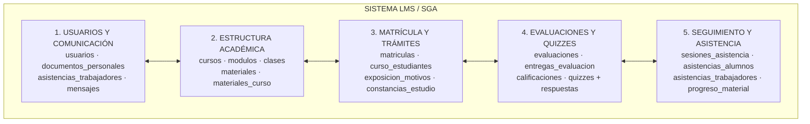
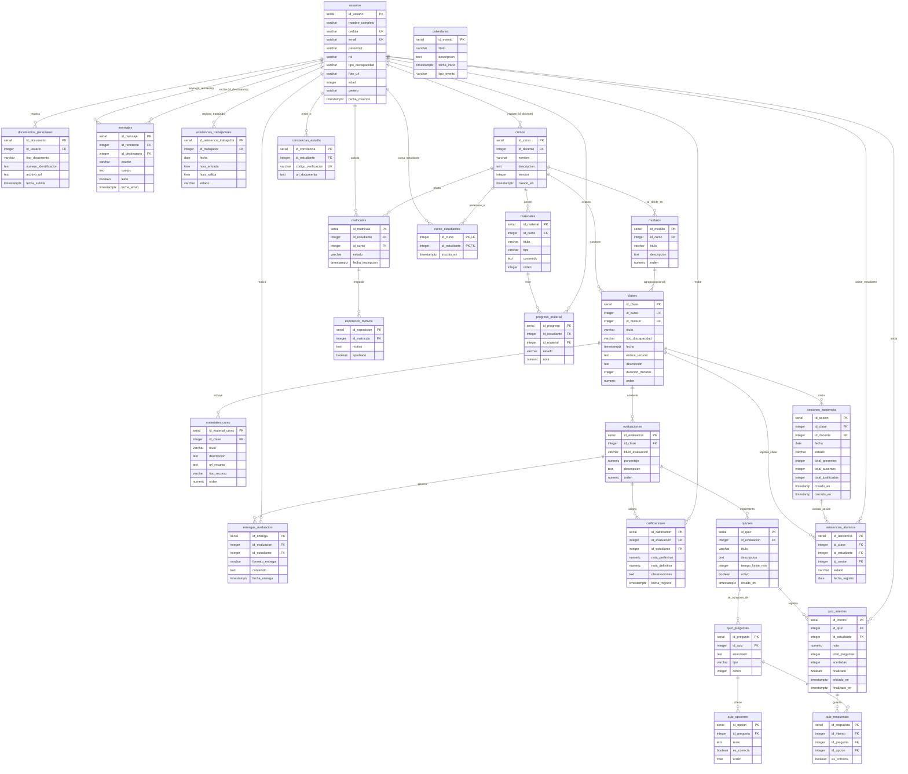
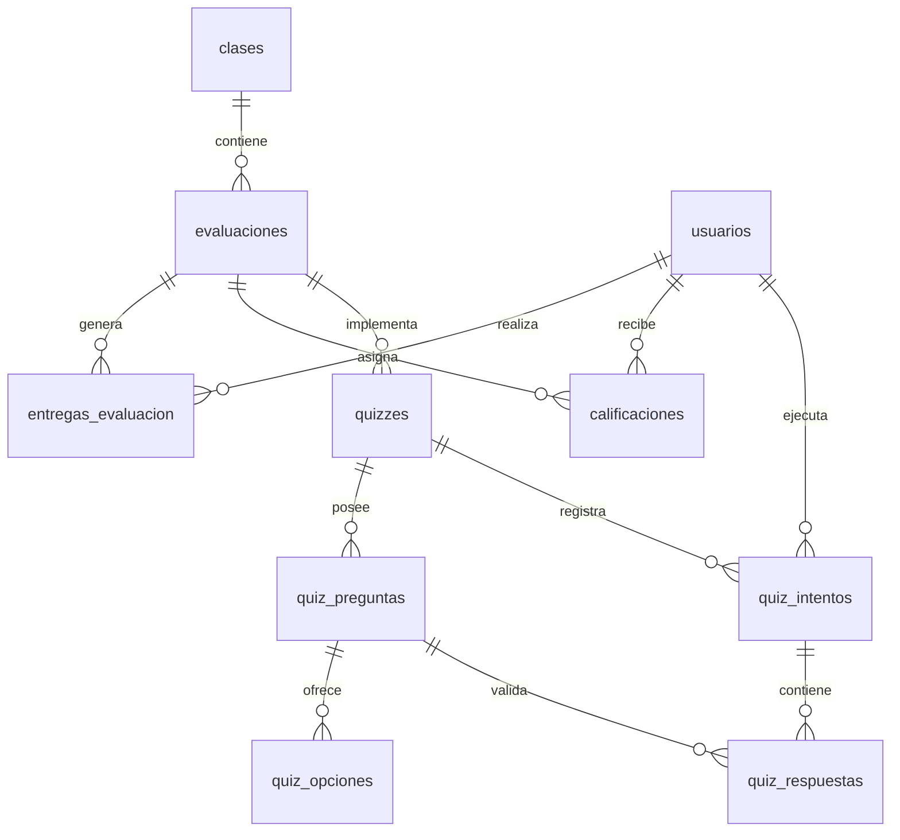
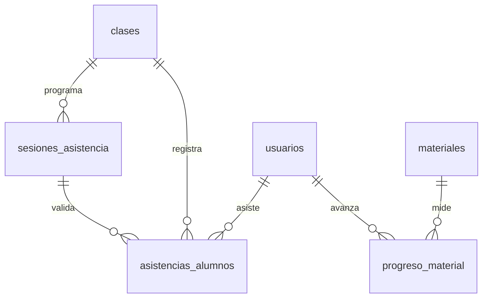
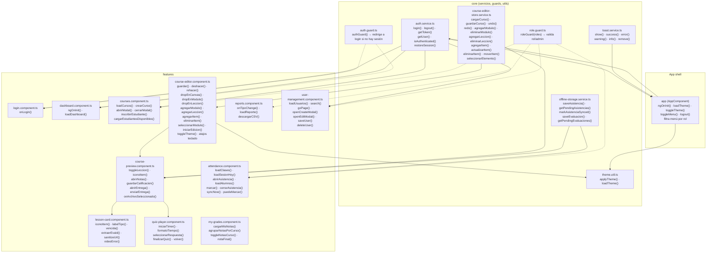
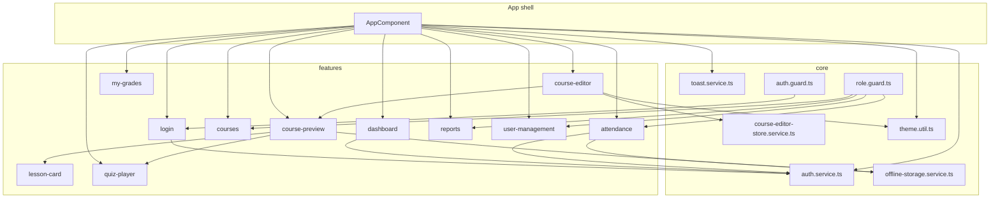

# Diagramas — Plataforma Educativa Cacique Tamanaco

Diagramas Mermaid generados a partir del esquema real de la base de datos
(`init-scripts/`) y de los componentes del frontend (`frontend/src/app/`).

---

## 1. Diagrama de la base de datos

> Esquema final: las tablas `tareas_curso` y `entregas_tarea` ya no existen
> (migración `08_migrar_tareas_a_evaluaciones.sql`).
>
> Para la **defensa de tesis** el DER se presenta en dos niveles de abstracción:
> un **mapa conceptual** de módulos funcionales (macro) y diagramas de **detalle**
> segmentados por subsistema. Las entidades están agrupadas jerárquicamente por
> módulo para que los generadores visuales (Mermaid Live Editor, Draw.io)
> desplieguen un diagrama limpio y ordenado.

### 1.1 Mapa conceptual de módulos (macro)

### 1.2 Diagrama ER completo estructurado por subsistemas (detalle)

### 1.3 Sub-diagramas modulares para diapositivas

**A. Subsistema de Evaluaciones y Quizzes**

> **Objetivo:** explicar cómo el sistema gestiona tanto evaluaciones
> tradicionales como exámenes interactivos (quizzes).

**B. Subsistema de Control de Asistencia y Progreso**

> **Objetivo:** demostrar la trazabilidad del estudiante respecto a la
> asistencia a clases y el consumo de contenidos.

---

## 2. Diagrama de componentes + funciones

---

## 3. Solo componentes

---

## Notas

- El diagrama de BD refleja las **28 tablas finales** (sin `tareas_curso`/`entregas_tarea`),
  organizadas en **5 módulos funcionales** para la defensa de tesis.
- Recomendaciones visuales para la defensa: 🟦 azul = usuarios/perfiles,
  🟩 verde = módulo académico, 🟨 amarillo/naranja = evaluaciones y quizzes,
  💜 púrpura = asistencia y progreso.
- El editor canvas es el componente más pesado: delega toda su mutación al
  `course-editor-store.service.ts` (undo/redo y atomicidad).
- Los guards protegen rutas: `authGuard` para sesión, `roleGuard` para roles
  (admin siempre pasa).
