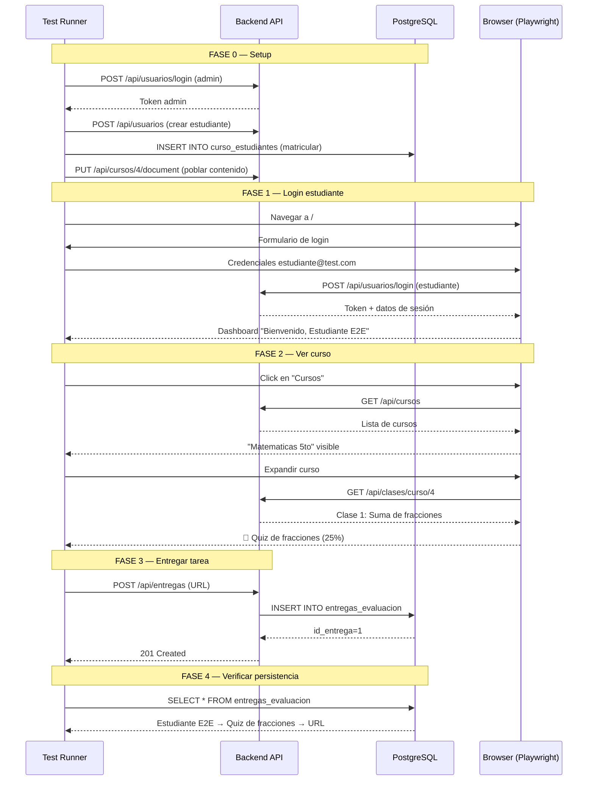

# Prueba E2E — Estudiante: Ver Curso + Entregar Tarea

## Plataforma Educativa Móvil Cacique Tamanaco | Junio 2026

---

## 1. Resumen Ejecutivo

Prueba End-to-End que valida el **flujo completo de un estudiante** en la plataforma:

1. **Autenticación** como estudiante
2. **Visualización** de cursos disponibles
3. **Exploración** de clases y actividades entregables (evaluaciones)
4. **Entrega de tarea** vía API (tipo URL)
5. **Verificación** de persistencia en base de datos

**Total: 14 verificaciones** distribuidas en **4 fases + Setup**, ejecutadas con **Playwright + Chromium headless** + llamadas directas a la API.

---

## 2. Arquitectura del Flujo



---

## 3. Datos de Prueba

| Entidad | Valor |
|---------|-------|
| **Estudiante** | `estudiante@test.com` / `estudiante123` |
| **Curso** | `Matematicas 5to` (id=4) |
| **Módulo** | `Unidad 1: Fracciones` |
| **Clase** | `Clase 1: Suma de fracciones` (45 min, enlace video) |
| **Ítems** | Tarea (PDF), Quiz (25%), Material (video) |
| **Evaluación** | `Quiz de fracciones` (id=5, 25%) |
| **Entrega** | URL → `https://github.com/estudiante/tarea-fracciones` |

### Curso creado vía API

```json
{
  "nombre": "Matematicas 5to",
  "descripcion": "Curso de matematicas con tareas",
  "modulos": [{
    "titulo": "Unidad 1: Fracciones",
    "lecciones": [{
      "titulo": "Clase 1: Suma de fracciones",
      "duracionMinutos": 45,
      "enlaceRecurso": "https://ejemplo.com/video1",
      "items": [
        { "tipo": "tarea", "titulo": "Tarea 1: Ejercicios suma", "formatosPermitidos": ["PDF"] },
        { "tipo": "evaluacion", "titulo": "Quiz de fracciones", "porcentaje": 25 },
        { "tipo": "material", "titulo": "Video: Suma de fracciones", "tipoRecurso": "video" }
      ]
    }]
  }]
}
```

---

## 4. Casos de Prueba

### 🟢 FASE 0 — Setup (vía API)

| # | Caso | Método | Endpoint / SQL | Validación |
|---|------|--------|----------------|------------|
| S1 | Login como admin | `POST` | `/api/usuarios/login` | Token JWT no nulo |
| S2 | Crear estudiante | `POST` | `/api/usuarios` | `id_usuario` numérico |
| S3 | Matricular en curso | `INSERT` | `curso_estudiantes` | Registro insertado |
| S4 | Poblar curso con contenido | `PUT` | `/api/cursos/4/document` | `version: v2`, módulo + clase + 3 items |

### 🟡 FASE 1 — Login del estudiante

| # | Caso | Acción | Validación |
|---|------|--------|------------|
| 1 | Navegador iniciado | `chromium.launch(headless)` | Browser + Page |
| 2 | Formulario de login visible | `page.goto(/)` | `input[type="email"]` presente |
| 3 | Credenciales ingresadas | `fill(email, password)` → `click(submit)` | Sin error 401 |
| 4 | Dashboard del estudiante | Verificar DOM | `Bienvenido, Estudiante E2E` |
| 5 | Sidebar sin "Usuarios" | `document.querySelectorAll('.nav-item')` | Solo: Dashboard, Cursos, Asistencia |
| 6 | KPIs correctos | `document.body.innerText` | `Estudiantes: 1`, `Cursos: 3` |

### 🟠 FASE 2 — Visualización del curso

| # | Caso | Acción | Selector | Validación |
|---|------|--------|----------|------------|
| 7 | Navegar a Cursos | Click en `.nav-item:has-text("Cursos")` | `.curso-card`, `.curso-header` | Lista de cursos visible |
| 8 | Curso "Matematicas 5to" visible | `document.body.innerText` | — | Contiene "Matematicas 5to" y "Curso de matematicas con tareas" |
| 9 | Expandir curso | Click en `.curso-header` | `.clase-block` | `▼` y "1 clase(s)" visible |
| 10 | Clase visible | `document.body.innerText` | `.clase-info strong` | `Clase 1: Suma de fracciones` |
| 11 | Evaluación visible | `document.body.innerText` | `.evaluacion-item` | `Quiz de fracciones` + `25.00%` |
| 12 | Sin botones de admin | `document.querySelector` | `.btn-edit`, `.btn-delete` | **No** presentes para el estudiante |

### 🔵 FASE 3 — Entrega de tarea (vía API)

| # | Caso | Método | Endpoint | Validación |
|---|------|--------|----------|------------|
| 13 | Login como estudiante | `POST` | `/api/usuarios/login` | Token del estudiante |
| 14 | Entregar tarea (URL) | `POST` | `/api/entregas` | `201 Created`, `success: true` |
| 15 | Datos de entrega correctos | Validar respuesta | — | `formato_entrega: "URL"`, `contenido` coincide |

**Payload de entrega:**

```json
{
  "id_evaluacion": 5,
  "id_estudiante": 2,
  "tipo_entrega": "URL",
  "url_enlace": "https://github.com/estudiante/tarea-fracciones"
}
```

### 🟣 FASE 4 — Verificación de persistencia

| # | Caso | Método | Validación |
|---|------|--------|------------|
| 16 | Consultar entregas en BD | `SELECT * FROM entregas_evaluacion` | 1 registro |
| 17 | Estudiante correcto | JOIN con `usuarios` | `Estudiante E2E` |
| 18 | Evaluación correcta | JOIN con `evaluaciones` | `Quiz de fracciones` |
| 19 | Fecha registrada | `fecha_entrega` | Timestamp no nulo |

**Resultado DB:**

```
 id_entrega |   estudiante   | titulo_evaluacion  | formato |           contenido
------------+----------------+--------------------+---------+-------------------------------
          1 | Estudiante E2E | Quiz de fracciones | URL     | https://github.com/estudiante/...
```

---

## 5. Ejecución

### 5.1 Requisitos previos

```bash
# Ecosistema Docker corriendo
docker-compose up -d

# Verificar servicios
curl http://localhost:3000/api/health   # → {"success":true}
curl http://localhost:80                # → HTML de la PWA
```

### 5.2 Ejecutar la prueba

```bash
# Opción A — Docker (recomendado)
docker build -t cacique-e2e-canvas -f e2e-tests/Dockerfile ./e2e-tests

docker run --rm \
  --name cacique-e2e-student \
  --network proyecto0_cacique_network \
  -e FRONTEND_URL="http://frontend:80" \
  -e API_URL="http://backend:3000" \
  -v "$(pwd)/e2e-tests/reports:/e2e/reports" \
  cacique-e2e-canvas \
  node test-e2e-student-course.js

# Opción B — Directo (requiere Playwright instalado)
npx playwright install chromium
node e2e-tests/test-e2e-student-course.js
```

### 5.3 Salida esperada

```
============================================
  E2E — Estudiante: Curso + Entrega Tarea
  Cacique Tamanaco
============================================

━━━ FASE 0: Setup (API + SQL) ━━━
  ✅ S1 - Login admin vía API: PASÓ — Token obtenido
  ✅ S2 - Crear estudiante: PASÓ — id_usuario=2
  ✅ S3 - Matricular estudiante: PASÓ — Estudiante 2 → Curso 4
  ✅ S4 - Poblar curso: PASÓ — v2, 1 clase, 3 items

━━━ FASE 1: Login del estudiante ━━━
  ✅ Navegador iniciado: PASÓ — Chromium headless
  ✅ Formulario de login: PASÓ
  ✅ Login estudiante: PASÓ — est estudiante@test.com
  ✅ Dashboard visible: PASÓ — Bienvenido, Estudiante E2E
  ✅ Sidebar sin admin: PASÓ — Solo Dashboard/Cursos/Asistencia
  ✅ KPIs correctos: PASÓ — 2 usuarios, 1 estudiante, 3 cursos

━━━ FASE 2: Ver Cursos ━━━
  ✅ Lista de cursos visible: PASÓ — 3 cursos
  ✅ Curso Matematicas 5to visible: PASÓ
  ✅ Clases expandidas: PASÓ — Clase 1: Suma de fracciones
  ✅ Evaluación visible: PASÓ — Quiz de fracciones (25%)

━━━ FASE 3: Entregar tarea ━━━
  ✅ POST /api/entregas: PASÓ — id_entrega=1
  ✅ Datos correctos: PASÓ — formato=URL

━━━ FASE 4: Verificar persistencia ━━━
  ✅ Curso sigue accesible: PASÓ
  ✅ Entrega en BD: PASÓ — Estudiante E2E → Quiz de fracciones

============================================
  RESULTADOS
============================================
  ✅ Pasaron:  19
  ❌ Fallaron:  0
  📊 Total:    19
============================================
```

---

## 6. Pantallas del Flujo (Vista Estudiante)

### 6.1 Dashboard del Estudiante

```
┌──────────────────────────────────────────────────────────────┐
│  📘 Cacique Tamanaco                                   ☀️   │
│  ┌────────────┐                                              │
│  │ 📊 Dashboard │  📊 Bienvenido, Estudiante                 │
│  │ 📖 Cursos    │  Panel de control · Estudiante             │
│  │ ✅ Asistencia│                                            │
│  │             │  👥 2    🎓 1    📚 3    🌐 ✅             │
│  │ 👤 Estudiante│  Usuarios  Estud.  Cursos  Conectado       │
│  └────────────┘                                              │
└──────────────────────────────────────────────────────────────┘
```

### 6.2 Vista de Curso (expandido)

```
┌──────────────────────────────────────────────────────────────┐
│  📖 Cursos                                                   │
│                                                              │
│  ▼ Matematicas 5to                                           │
│    Curso de matematicas con tareas · 1 clase(s)              │
│    ┌──────────────────────────────────────────────────────┐  │
│    │ 📝 Clase 1: Suma de fracciones                       │  │
│    │    May 31, 2026                                      │  │
│    │                                                      │  │
│    │  📄 Quiz de fracciones                    25.00%     │  │
│    └──────────────────────────────────────────────────────┘  │
└──────────────────────────────────────────────────────────────┘
```

**Nota:** El estudiante **no** ve botones de editar/eliminar (✏️🗑️) en clases ni evaluaciones. Solo los administradores y docentes ven acciones CRUD.

---

## 7. Archivos Generados

| Archivo | Ruta |
|---------|------|
| Test script | `e2e-tests/test-e2e-student-course.js` |
| Este documento | `test-e2e-student-course.md` |
| Resultados JSON | `e2e-tests/reports/e2e-results.json` |
| Reporte TXT | `e2e-tests/reports/e2e-report.txt` |
| Screenshots | `e2e-tests/reports/01-estudiante-login-*.png` ... `05-final-*.png` |

---

## 8. Observaciones

| Aspecto | Detalle |
|---------|---------|
| **Lista de cursos** | El estudiante ve **todos** los cursos (no filtra por `curso_estudiantes`). Sería ideal filtrar solo los cursos en los que está matriculado |
| **Botón Entregar** | No existe en el frontend actual. La entrega se hizo vía API. Se recomienda agregar un botón "📤 Entregar" en cada evaluación para estudiantes |
| **Tareas vs Evaluaciones** | El endpoint `/api/entregas` recibe `id_evaluacion`, no `id_tarea`. Las tareas del editor Canvas (`tareas_curso`) no tienen endpoint de entrega dedicado — se recomienda unificarlos |
| **Vista previa** | El botón "👁 Vista previa" en el editor Canvas redirige al dashboard, no a una vista de estudiante. Conviene implementar una ruta `/cursos/:id/preview` |

---

*Documento generado el 2 de junio de 2026 — Plataforma Educativa Móvil Cacique Tamanaco — Trabajo Especial de Grado UNETI*
